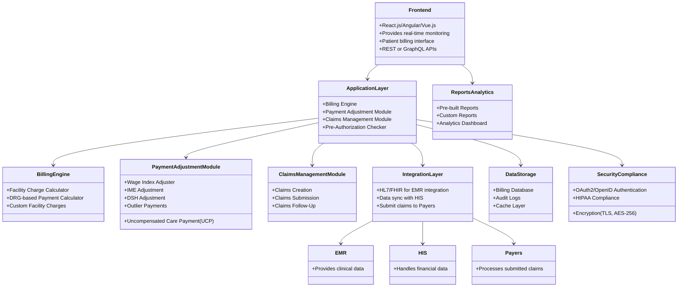
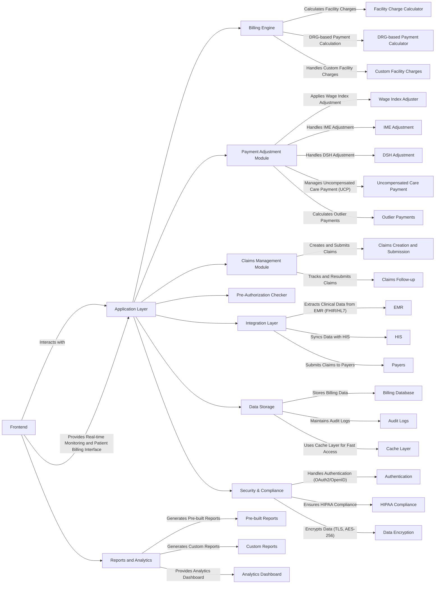
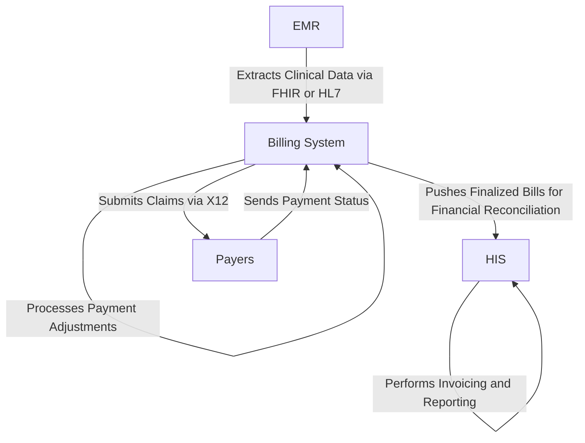

# Facility Billing System Architectur

## Class view

```mermaid
classDiagram
    class Frontend {
      +React.js/Angular/Vue.js
      +Provides real-time monitoring
      +Patient billing interface
      +REST or GraphQL APIs
    }

    class ApplicationLayer {
      +Billing Engine
      +Payment Adjustment Module
      +Claims Management Module
      +Pre-Authorization Checker
    }

    class BillingEngine {
      +Facility Charge Calculator
      +DRG-based Payment Calculator
      +Custom Facility Charges
    }

    class PaymentAdjustmentModule {
      +Wage Index Adjuster
      +IME Adjustment
      +DSH Adjustment
      +Uncompensated Care Payment (UCP)
      +Outlier Payments
    }

    class ClaimsManagementModule {
      +Claims Creation
      +Claims Submission
      +Claims Follow-Up
    }

    class IntegrationLayer {
      +HL7/FHIR for EMR integration
      +Data sync with HIS
      +Submit claims to Payers
    }

    class EMR {
      +Provides clinical data
    }

    class HIS {
      +Handles financial data
    }

    class Payers {
      +Processes submitted claims
    }

    class DataStorage {
      +Billing Database
      +Audit Logs
      +Cache Layer
    }

    class SecurityCompliance {
      +OAuth2/OpenID Authentication
      +HIPAA Compliance
      +Encryption (TLS, AES-256)
    }

    class ReportsAnalytics {
      +Pre-built Reports
      +Custom Reports
      +Analytics Dashboard
    }

    Frontend --> ApplicationLayer
    ApplicationLayer --> BillingEngine
    ApplicationLayer --> PaymentAdjustmentModule
    ApplicationLayer --> ClaimsManagementModule
    ApplicationLayer --> IntegrationLayer
    IntegrationLayer --> EMR
    IntegrationLayer --> HIS
    IntegrationLayer --> Payers
    ApplicationLayer --> DataStorage
    ApplicationLayer --> SecurityCompliance
    Frontend --> ReportsAnalytics
```
## Components view

```mermaid
flowchart LR
    %% Frontend Layer
    A[Frontend] -->|Interacts with| B[Application Layer]
    A -->|"Provides Real-time Monitoring and Patient Billing Interface"| B

    %% Application Layer Components
    B --> C[Billing Engine]
    B --> D[Payment Adjustment Module]
    B --> E[Claims Management Module]
    B --> F[Pre-Authorization Checker]

    %% Billing Engine Sub-components
    C -->|"Calculates Facility Charges"| G[Facility Charge Calculator]
    C -->|"DRG-based Payment Calculation"| H[DRG-based Payment Calculator]
    C -->|"Handles Custom Facility Charges"| I[Custom Facility Charges]

    %% Payment Adjustment Module Sub-components
    D -->|"Applies Wage Index Adjustment"| J[Wage Index Adjuster]
    D -->|"Handles IME Adjustment"| K[IME Adjustment]
    D -->|"Handles DSH Adjustment"| L[DSH Adjustment]
    D -->|"Manages Uncompensated Care Payment (UCP)"| M[Uncompensated Care Payment]
    D -->|"Calculates Outlier Payments"| N[Outlier Payments]

    %% Claims Management Module
    E -->|"Creates and Submits Claims"| O[Claims Creation and Submission]
    E -->|"Tracks and Resubmits Claims"| P[Claims Follow-up]

    %% Integration Layer Connections
    B --> Q[Integration Layer]
    Q -->|"Extracts Clinical Data from EMR (FHIR/HL7)"| R[EMR]
    Q -->|"Syncs Data with HIS"| S[HIS]
    Q -->|"Submits Claims to Payers"| T[Payers]

    %% Data Storage
    B --> U[Data Storage]
    U -->|"Stores Billing Data"| V[Billing Database]
    U -->|"Maintains Audit Logs"| W[Audit Logs]
    U -->|"Uses Cache Layer for Fast Access"| X[Cache Layer]

    %% Security & Compliance
    B --> Y[Security & Compliance]
    Y -->|"Handles Authentication (OAuth2/OpenID)"| Z[Authentication]
    Y -->|"Ensures HIPAA Compliance"| AA[HIPAA Compliance]
    Y -->|"Encrypts Data (TLS, AES-256)"| AB[Data Encryption]

    %% Reports and Analytics
    A --> AC[Reports and Analytics]
    AC -->|"Generates Pre-built Reports"| AD[Pre-built Reports]
    AC -->|"Generates Custom Reports"| AE[Custom Reports]
    AC -->|"Provides Analytics Dashboard"| AF[Analytics Dashboard]
```
# Billing System Data Flow

```mermaid
flowchart TD
    %% EMR to Billing System
    A[EMR] -->|"Extracts Clinical Data via FHIR or HL7"| B[Billing System]
    B -->|"Generates Patient-Specific Bills"| B

    %% Billing System to HIS
    B -->|"Pushes Finalized Bills for Financial Reconciliation"| C[HIS]
    C -->|"Performs Invoicing and Reporting"| C

    %% Billing System to Payers
    B -->|"Processes Payment Adjustments"| B
    B -->|"Submits Claims via X12"| D[Payers]
    D -->|"Sends Payment Status"| B
```
